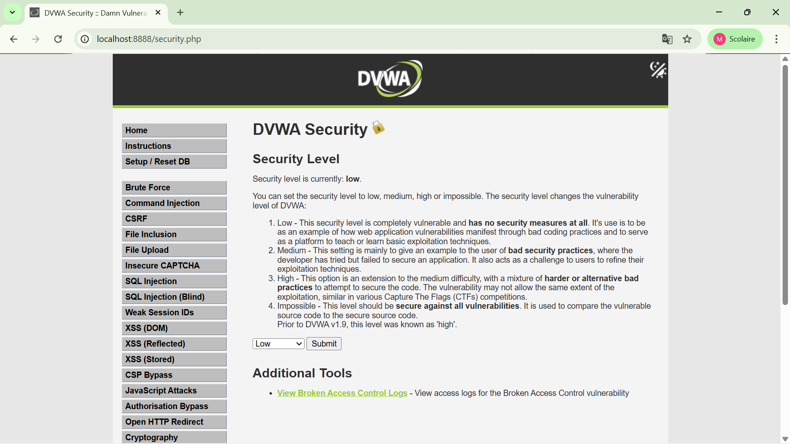
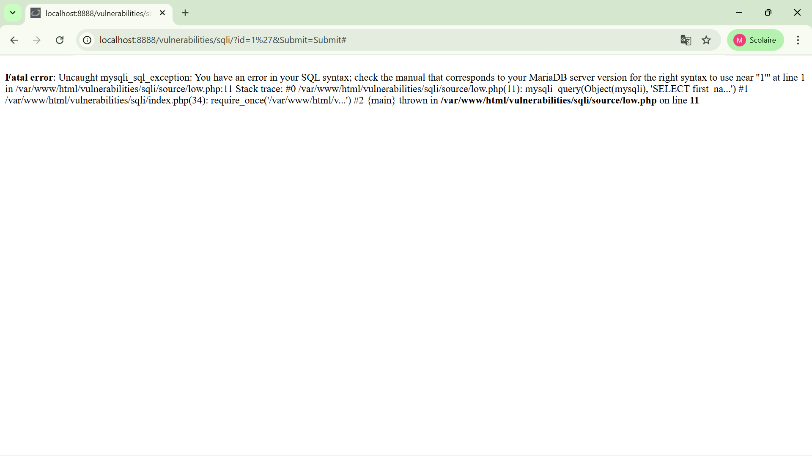
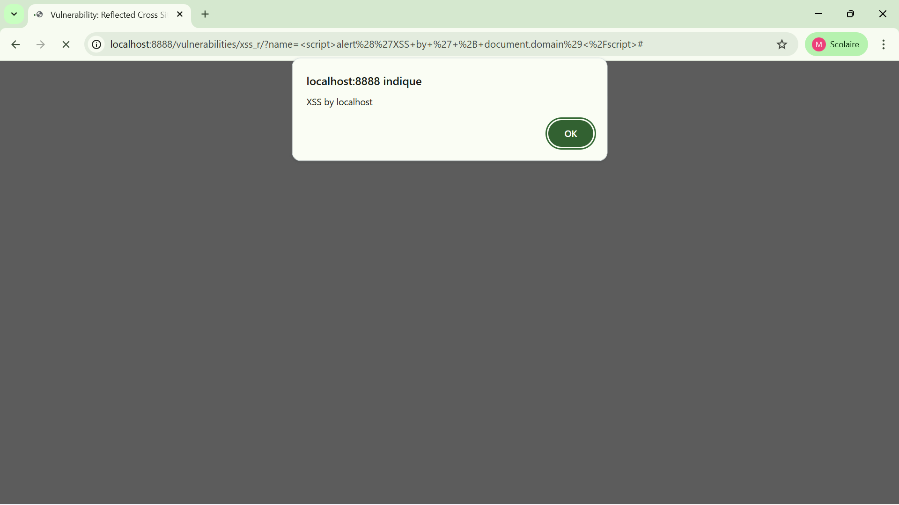
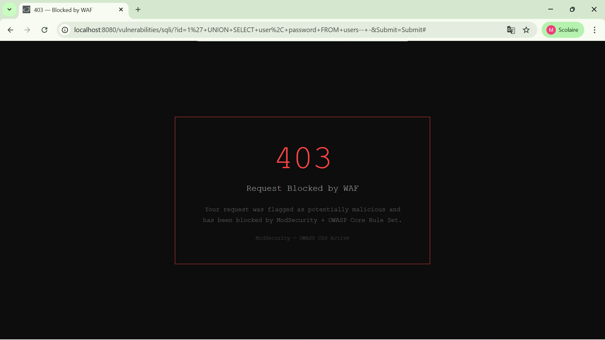
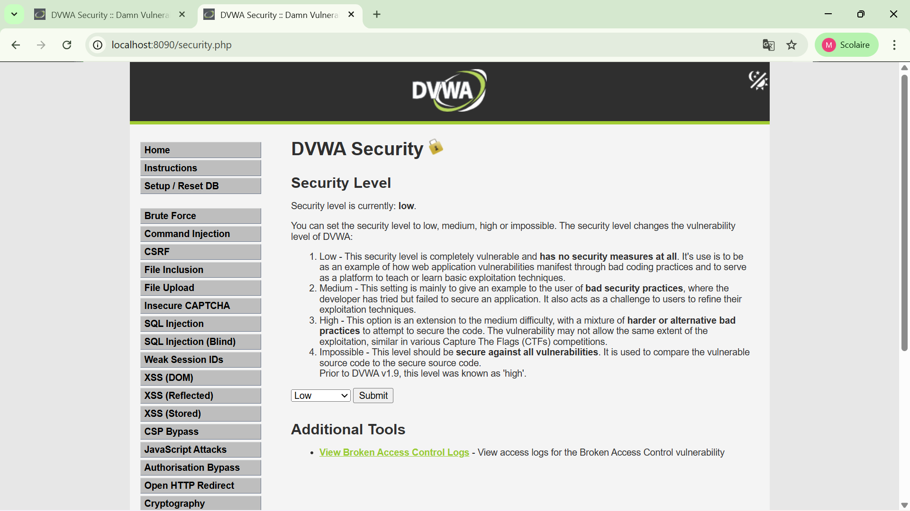
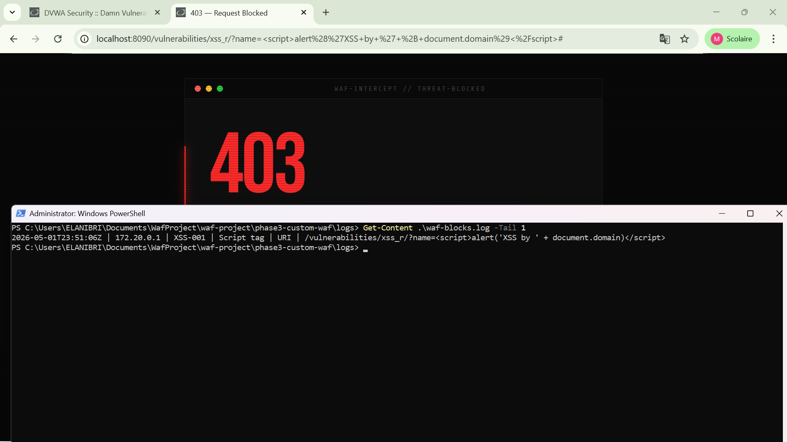

# Final Report — WAF Project

## 1. Overview

This project delivers a three-phase web application security lab using DVWA and WAF defenses.
The environment was built with Docker Compose and progressively hardened from an unprotected target (Phase 1) to ModSecurity protection (Phase 2) and a custom Python-based WAF (Phase 3).

## 2. Architecture & Setup

### 2.1 Environment Architecture

- **Phase 1**: Direct access to DVWA on `http://localhost:8888` with MariaDB backing the vulnerable web application.
- **Phase 2**: A ModSecurity CRS-enabled Nginx reverse proxy protects DVWA on `http://localhost:8080` while the raw DVWA target remains available on `http://localhost:8888`.
- **Phase 3**: A custom Python/aiohttp reverse proxy WAF protects DVWA on `http://localhost:8090`.

The stack is orchestrated from `docker-compose.yml`.

### 2.2 Components

- `docker-compose.yml`
  - Defines `db`, `dvwa`, `waf` (Phase 2), and `phase3-waf` (Phase 3).
- `phase1-target/`
  - Contains DVWA attack walkthroughs and vulnerability confirmation screenshots.
- `phase2-modsecurity/`
  - Contains the ModSecurity Nginx configuration and WAF proof screenshots.
- `phase3-custom-waf/`
  - Implements the custom WAF with `waf.py`, `config.py`, `engine/`, and a custom block page.

### 2.3 How it was built

1. **Phase 1**: Started DVWA and MariaDB only with:
   ```bash
docker compose up dvwa db -d
```
2. **Phase 2**: Started the full ModSecurity stack with:
   ```bash
docker compose up -d
```
   - ModSecurity CRS forwards requests from `8080` to DVWA.
   - Custom exclusions in `phase2-modsecurity/crs-setup/custom-exclusions.conf` reduce false positives.
3. **Phase 3**: Built and added a custom WAF service in `docker-compose.yml`:
   - `build: ./phase3-custom-waf`
   - `BACKEND_URL=http://dvwa:80`
   - exposed on `8090`
   - logs written to `phase3-custom-waf/logs/waf-blocks.log`

### 2.4 Custom WAF design

The Phase 3 WAF consists of:

- `phase3-custom-waf/waf.py`
  - aiohttp reverse proxy that inspects and forwards requests.
- `phase3-custom-waf/config.py`
  - Reads environment variables for Docker compatibility.
- `phase3-custom-waf/engine/rules.py`
  - Contains 12 regex-based detection signatures (6 SQLi + 6 XSS).
- `phase3-custom-waf/engine/inspector.py`
  - Inspects request path, query, headers, and body.
- `phase3-custom-waf/engine/responder.py`
  - Returns a custom 403 block page.
- `phase3-custom-waf/engine/logger.py`
  - Writes async pipe-delimited block logs.

## 3. Proof of Concept

### 3.1 Phase 1 — Vulnerable DVWA attack confirmation

The initial phase proves the vulnerable application is exploitable without any WAF protection.

- `phase1-target/screenshots/dvwaSecurityLevel_low.png` — DVWA configured to Low security.
- `phase1-target/screenshots/SQLi_exists.png` — SQL injection attack surface confirmed.
- `phase1-target/screenshots/SQLi_exploited1.png` and `phase1-target/screenshots/SQLi_exploited2.png` — Successful SQLi payload execution.
- `phase1-target/screenshots/XSS-reflected_try.png` and `phase1-target/screenshots/XSS-reflected_Works.png` — Reflected XSS executed successfully.







### 3.2 Phase 2 — ModSecurity WAF blocking attacks

This phase demonstrates ModSecurity CRS actively blocking malicious input while allowing normal traffic.

- `phase2-modsecurity/screenshots/SQLi_try.png` — Attack request sent through the WAF.
- `phase2-modsecurity/screenshots/SQLi_Block.png` — ModSecurity returned a block response.
- `phase2-modsecurity/screenshots/XSS_ty1.png` — XSS payload attempt through the WAF.
- `phase2-modsecurity/screenshots/XSS_Block.png` — WAF blocked the XSS attack.
- `phase2-modsecurity/screenshots/normalUse_Allow.png` and `phase2-modsecurity/screenshots/normalUse2_allow.png` — Normal requests passed successfully.




### 3.3 Phase 3 — Custom WAF blocking and logging

The custom WAF inspects requests, applies regex rules, returns a custom block page and logs events.

- `phase3-custom-waf/screenshots/verifyInCustomWafLisPort.png` — Custom WAF active on `http://localhost:8090`.
- `phase3-custom-waf/screenshots/SQLi-test.png` — SQLi request passed to the custom WAF.
- `phase3-custom-waf/screenshots/SQLi-Unionattack-block.png` — UNION-based SQLi blocked.
- `phase3-custom-waf/screenshots/SQLi-unionatackBlockandLogs.png` — Block page plus log entry for the UNION attack.
- `phase3-custom-waf/screenshots/SQLi-SleepBlock.png` and `phase3-custom-waf/screenshots/SQLi-SleepBlockandLogs.png` — Sleep-based blind SQLi blocked and recorded.
- `phase3-custom-waf/screenshots/XSS-reflectedBLock.png`, `phase3-custom-waf/screenshots/XSS-reflectedBlockAndLogs.png`, and `phase3-custom-waf/screenshots/XSS-reflectedBLockAndlLogs2.png` — Reflected XSS detection, blocking and logging.
- `phase3-custom-waf/screenshots/FullPackRunning.png` — Full custom WAF service running.
- `phase3-custom-waf/screenshots/minFalsePositives.png` — Proof of tuning to reduce false positives.






### 3.4 Logs and blocking evidence

- Custom WAF logs are stored in `phase3-custom-waf/logs/waf-blocks.log`.
- `phase3-custom-waf/screenshots/*Logs*.png` evidence shows the block page and the generated log entries.
- ModSecurity block evidence is available in `phase2-modsecurity/screenshots` and linked above.

## 4. Summary

This project demonstrates:

- A baseline vulnerable target in Phase 1.
- Phase 2 protection using ModSecurity CRS on an Nginx reverse proxy.
- Phase 3 protection using a custom Python/aiohttp WAF with request inspection, custom block page, and async logging.

The proof of concept is supported by screenshots from all three phases showing both successful attacks against the unprotected target and successful blocks with both WAF implementations.

---

## Appendix — Screenshot references

- Phase 1 screenshots: `phase1-target/screenshots/`
- Phase 2 screenshots: `phase2-modsecurity/screenshots/`
- Phase 3 screenshots: `phase3-custom-waf/screenshots/`
